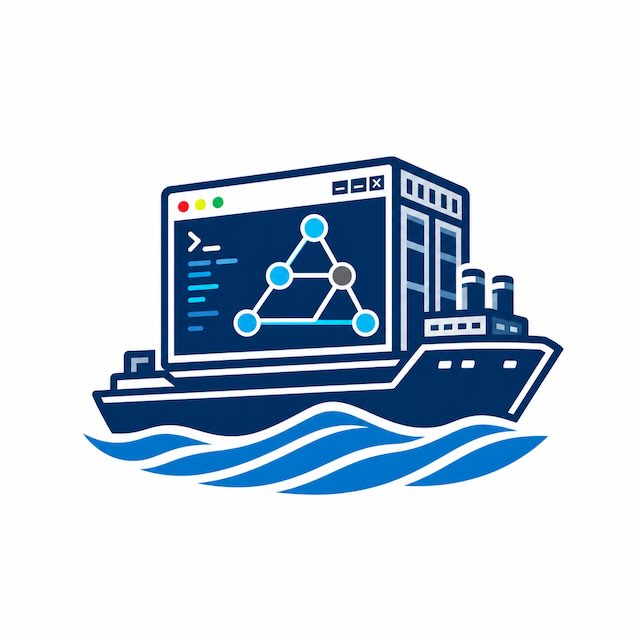
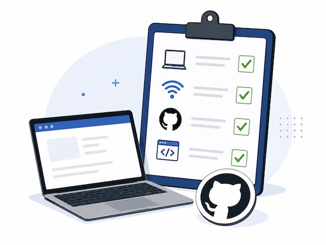
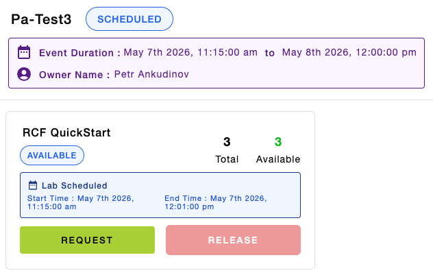
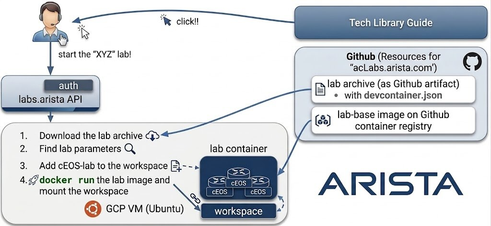
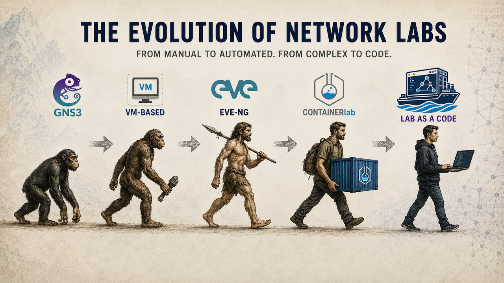
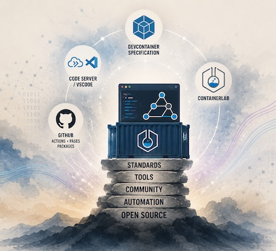

<!-- _class: titlepage -->
<!-- _paginate: false -->

# Better Labs on GitHub and Private Infra



> { "event": "Autocon5", "session": "WS:A4" }

<style scoped>
section {
  font-size: 22px;
}
pre {
  font-size: 16px;
}
</style>

```python
#!/usr/bin/env python3

__author__ = [
  "Petr Ankudinov (pa@), Senior Solutions Engineer",
  "Mitch Vaughan (mitch@), Principal Engineer",
  "Carl Buchmann (carl.buchmann@), Manager"
]
```

```bash
$ date +"%b %Y"
Jun 2026
```

---

# Credits

<style scoped>
section {
  font-size: 20px;
}
</style>


- Slides are created in [Marp](https://github.com/marp-team/marp) by Yuki Hattori
- Marp makes it easy to build, share, and publish rich Markdown slides from CI
- Check [Marp awesome list](https://github.com/marp-team/awesome-marp) and build your next slide deck in Marp
- Most images are from [Pexels](https://www.pexels.com/) or generated by AI
- Wi-Fi & Connectivity
  - Network Name: **[wifi-ssid]**
  - Password: **[wifi-password]**
- Workshop repo: [ankudinov/aclabs-workshop-june-2026](https://github.com/ankudinov/aclabs-workshop-june-2026)

> Scan QR code to access the workshop repository.

---

# Agenda

<style scoped>section {font-size: 13px;}</style>
<style scoped>p {font-size: 13px;}</style>

:fast_forward: Start: 09:00

- Kickoff & Infrastructure:
  - Intro, logistics, and `labs.arista` environment overview and user assignment
- Evolution of the Network Automation and Lab Environment
  - Yet another ~~dev~~ lab environment challenge and Dev Container intro
  - The journey from early AVD container images to a cloud-hosted labs
  - Containerlab on GitHub Codespaces and why everyone can build this
- The Deeplink Mandate:
  - Understanding why deeplinks are critical for reproducibility and workflow efficiency
- Getting Started Hands-On:
  - Setup a lab repository, Codespaces start-stop exercise
  - Container pre-builds and why they are <u>**VERY**</u> important
  - The story of two platforms: ARMing your lab
- A survival guide to SELinux, the kernel and permissions

☕ Break: 10:45 - 11:15

- The Great Escape
  - Building lab archives on GitHub pages
  - Smart entrypoints and VS Code tasks to solve image import and routines
  - Code-server - the perfect UI
  - Building a simple API for deeplink support
- Summary, credits and call for a change

🛑 Stop: 13:00


---

# What You Need Today

<style scoped>section {font-size: 22px;}</style>
<style scoped>p {font-size: 22px;}</style>

Participants need:

- A healthy laptop with a working browser
- Reliable Internet access for the full session
- A GitHub account you can sign into quickly
- Optional GitHub Codespaces access

A good level of system administration / Linux skills expected

- Useful reference materials
  - [GitSCM book](https://git-scm.com/book/en/v2)
  - [Git cheat-sheet](https://education.github.com/git-cheat-sheet-education.pdf)
  - [container.training](https://container.training/)
  - [VSCode tutorial](https://code.visualstudio.com/docs/getstarted/getting-started)

> GitHub access is the critical dependency for the hands-on flow.



---

# Meet `labs.arista`

<style scoped>
section {
  font-size: 22px;
}
</style>

- [labs.arista.com](https://labs.arista.com/) provides UI, API, Cloud runtime and event management for unified containerized lab backend
- Arista employees and customers can access most of the labs in a single click
  - Example: [AVD Playground](https://avd.arista.com/6.1/ansible_collections/arista/avd/examples/index.html#avd-playground)
- However for this workshop we'll use event management tool to avoid auth restrictions
  - <mark>IMPORTANT:</mark> Provide a valid email when registering!
- [Click this link](add-link-later) to get your lab instance
  - The lab VM will be running for approx. 8 hours and is not persistent
  - Save any progress you need for later outside of the VM



---

# How It Works

<style scoped>section {font-size: 16px;}</style>
<style scoped>p {font-size: 16px;}</style>

- The key idea
  - Single click to start any lab
  - The link can be integrated to any Web resource, doc or [this slide](https://labs.arista.com/launch?lab_type=avd-playground&origin=tech-lib)
  - Consistent and ready to use lab environment every time
  - Familiar VSCode UI and features for everything
  - Build on top of existing Open Source initiatives!
- Components
  - A document in your web browser to click the link and open the lab UI
  - [labs.arista](https://labs.arista.com/) for auth, API and GCP backend
    - This is the only proprietary part of the solution!
  - [acLabs](https://aclabs.arista.com/) - lab packages and lab-base container images

> TARGET 🎯: Build a very similar setup during the workshop!
> WHY: The way we used to build labs is <u>obsolete</u>. Let's build better labs!



---



---

# How It Started

<style scoped>section {font-size: 16px;}</style>
<style scoped>p {font-size: 16px;}</style>

> New ideas are simply old thoughts that finally found each other

- It's all started with Arista AVD in 2020
  - We had to solve a common challenge of building a healthy and stable environment
    - Good old "Works on my machine" challenge
  - Around this time dev container specification emerges - logical choice to build the env
    - Already waiting for Codespaces GA
  - 2021 - baby steps: all-in-one pre-build container
  - End of 2022 - GitHub Codespaces GA
    - 2023 - first attempt to socialize the new approach to labs at [Ansible Community Day](https://ankudinov.github.io/ansible-devcontainer/#1)
  - early 2024 - AVD container images with every release
    - wait, this works well with Containerlab!
  - early 2024 - [One-Click SE Demos](https://arista-netdevops-community.github.io/one-click-se-demos/)
  - early 2024 - [TechLibrary](https://tech-library.arista.com/)
  - end 2024 - [acLabs](https://aclabs.arista.com/) as community lab collection and TechLibrary labs backend
  - end of 2024 - [NAN074](https://packetpushers.net/podcasts/network-automation-nerds/nan074-integrate-and-collaborate-with-codespaces-and-containerlab/) with Eric Chou and Roman Dodin
    - First community success, but the key idea is still well hidden between the lines
  - Jan 2026 - Project cArL birthday (Containerized Arista Labs)
    - labs.arista / acLabs / TechLibrary / AVD integration
  - Now - time to make this a new lab standard


---

# Credits and Notable Projects

<style scoped>section {font-size: 22px;}</style>
<style scoped>p {font-size: 22px;}</style>

> "If I have seen further, it is by standing on the shoulders of giants"

Building a better lab would be much harder without:

- Devcontainer specification
- Code Server / VSCode
- GitHub and GitHub Actions, Pages and Packages
- Containerlab

Honorable mention:

- [labs.iximiuz.com](https://labs.iximiuz.com/)
  - Not directly related and not aimed at network engineers
  - Still a great and inspiring lab implementation



---

# What Is Dev Container

<style scoped>
section {font-size: 17px;}
p { font-size: 17px; }
</style>

<div class="columns">
<div>

- It's a container 🙂
  - When it runs, it's not much different to "normal" container
  - However it's empowered by Dev Container specification
- [Development Container Specification @ containers.dev](https://containers.dev/)
  - Originally a proprietary standard for VSCode remote development
  - Open-sourced by Microsoft in 2022
  - Defines metadata to build, open and customize the dev environment
  - Works best with a [supporting tool](https://containers.dev/supporting)
    - The most well known is VS Code with Dev Containers extension
  - Keeps the environment definition close to the repo

</div>
<div>

```jsonc
// .devcontainer/devcontainer.json
{
  // Start from a known base image
  "image": "mcr.microsoft.com/devcontainers/base:ubuntu",

  // Add standard tools during create
  "features": {
    "ghcr.io/devcontainers/features/python:1": { "version": "3.11" },
    "ghcr.io/devcontainers/features/docker-in-docker:2": {}
  },

  // Make the repo ready on first open
  "postCreateCommand": "pip install -r requirements.txt",

  // Useful for docs preview or a small lab UI
  "forwardPorts": [8000]
}
```

</div>
</div>

---

<style scoped>
section {font-size: 17px;}
p { font-size: 17px; }
</style>

# Hands-on: Create a Dev Container and Start/Stop a Codespace

<div class="columns">
<div>

- Init a new empty repo on Github
  - Call it `ac5-workshop`
- Clone the repo to the Sandbox Lab environment
  - Do not forget to authenticate!
- Create following files:
  - `.devcontainer/devcontainer.json`
  - `requirements.txt`
  - `init.sh`
- Make init script executable:
  - `chmod +x init.sh`
- Commit and push
- Start the Codespace
- Check
- Stop and delete the Codespace

</div>
<div>

```jsonc
// .devcontainer/devcontainer.json
{
  "image": "ghcr.io/aristanetworks/avd/universal:python3.12-avd-v6.1.0",
  "remoteUser": "avd",
  "onCreateCommand": "${containerWorkspaceFolder}/init.sh"
}
```

```bash
# requirements.txt
rich==13.9.4
```

```bash
#!/usr/bin/env bash

# init.sh

set +e
pip install -r requirements.txt
wget https://raw.githubusercontent.com/textualize/rich/refs/heads/master/examples/tree.py
echo "alias rich='python3 tree.py $(pwd)'" >> /home/avd/.zshrc
cp -r /home/avd/.ansible/collections/ansible_collections/arista/avd/examples/single-dc-l3ls/* .
```

> Fun fact: AVD Container Images might be the first ever pre-build dev environment for network engineers

</div>
</div>
